# Progetto Settimana 16 – Social Network (Consegna D5)

Continuazione del social network. L'applicazione permette di:

- creare **post con fotografie**: una singola foto scattata con la **fotocamera** oppure **una o più foto caricate** dal dispositivo, con verifica del formato dei file sia lato frontend sia lato backend;
- associare a ogni post la **posizione** in cui sono state scattate le foto, scegliendo un punto sulla mappa oppure indicando un indirizzo. Coordinate e indirizzo appartengono al **post**, non alle singole foto;
- caricare **documenti sul proprio profilo**, elaborati automaticamente con **OCR** per estrarne il contenuto testuale.

---

## Indice

1. [Struttura del repository](#1-struttura-del-repository)
2. [Backend](#2-backend)
   - [2.1 Stack tecnologico](#21-stack-tecnologico)
   - [2.2 Architettura](#22-architettura)
   - [2.3 Modello del database ed entità](#23-modello-del-database-ed-entità)
   - [2.4 Struttura dei controller](#24-struttura-dei-controller)
   - [2.5 Endpoint delle API](#25-endpoint-delle-api)
   - [2.6 Modalità di implementazione delle funzionalità](#26-modalità-di-implementazione-delle-funzionalità)
   - [2.7 Librerie utilizzate](#27-librerie-utilizzate)
   - [2.8 Servizi esterni](#28-servizi-esterni)
   - [2.9 Configurazione e avvio](#29-configurazione-e-avvio)
   - [2.10 Test](#210-test)
   - [2.11 Limiti noti e possibili evoluzioni](#211-limiti-noti-e-possibili-evoluzioni)
3. [Frontend](#3-frontend)
   - [3.1 Stack tecnologico](#31-stack-tecnologico)
   - [3.2 Scelte progettuali](#32-scelte-progettuali)
   - [3.3 Struttura delle cartelle](#33-struttura-delle-cartelle)
   - [3.4 Pagine e componenti](#34-pagine-e-componenti)
   - [3.5 Modalità di implementazione delle funzionalità](#35-modalità-di-implementazione-delle-funzionalità)
   - [3.6 Librerie utilizzate](#36-librerie-utilizzate)
   - [3.7 Servizi esterni](#37-servizi-esterni)
   - [3.8 Configurazione e avvio](#38-configurazione-e-avvio)
   - [3.9 Test](#39-test)
   - [3.10 Limiti noti e possibili evoluzioni](#310-limiti-noti-e-possibili-evoluzioni)
   - [3.11 Screenshot](#311-screenshot)

---

## 1. Struttura del repository

```
Progetto-settimana-16/
├── README.md                  ← questa documentazione (backend + frontend)
├── .gitignore
├── backend/                   ← API REST Spring Boot
│   ├── pom.xml
│   ├── mvnw, mvnw.cmd, .mvn/  ← Maven Wrapper (non serve installare Maven)
│   ├── env.properties.example ← modello dei segreti locali
│   ├── postman/               ← collection ed environment Postman, con i file di esempio
│   └── src/
│       ├── main/java/org/example/progettosettimana16/
│       │   ├── config/        ← proprietà, sicurezza, pool asincrono
│       │   ├── controller/    ← endpoint REST
│       │   ├── dto/           ← oggetti di richiesta/risposta (record)
│       │   ├── entity/        ← entità JPA e regole di dominio
│       │   ├── exception/     ← errori applicativi e gestione centralizzata
│       │   ├── ocr/           ← motore Tesseract ed elaborazione asincrona
│       │   ├── repository/    ← Spring Data JPA
│       │   ├── security/      ← JWT (generazione, verifica, filtro)
│       │   ├── service/       ← logica applicativa
│       │   └── storage/       ← validazione formato e salvataggio file
│       ├── main/resources/application.properties
│       └── test/              ← test unitari e d'integrazione
└── frontend/                  ← applicazione client React + Vite
    ├── package.json
    ├── vite.config.js
    ├── index.html
    ├── PRODUCT.md             ← contesto di prodotto e impegni della brand identity
    ├── DESIGN.md              ← design system "Scatto": token, tipografia, griglia e regole d'uso
    ├── public/favicon.svg     ← segno del logo
    ├── docs/screenshots/      ← screenshot dell'applicazione usati in questo README
    ├── .env.example           ← modello di VITE_API_URL (il file reale .env.local non è versionato)
    └── src/
        ├── main.jsx, App.jsx  ← avvio, font del brand, router e rotte
        ├── index.css          ← token del brand Scatto (colori, font, forme, movimento) e stili condivisi
        ├── auth/              ← contesto di autenticazione (token e utente)
        ├── components/        ← componenti riusabili: post, mappa, fotocamera, upload, documenti
        ├── lib/               ← chiamate API, verifica dei file, formattazione, paginazione
        └── pages/             ← pagine: accesso, feed, nuovo post, profilo
```

---

## 2. Backend

### 2.1 Stack tecnologico

| Componente | Versione | Ruolo |
|---|---|---|
| Java | 25 | Linguaggio |
| Spring Boot | 4.1.1 | Framework applicativo |
| Spring Web MVC | 7 | API REST, upload multipart |
| Spring Security | 7 | Autenticazione stateless con JWT |
| Spring Data JPA / Hibernate | 7 | Persistenza |
| PostgreSQL | 18 | Database |
| Tesseract OCR (tess4j) | 5.5 / 5.19.0 | Estrazione del testo dai documenti |
| Maven Wrapper | 3.9 | Build |

### 2.2 Architettura

Il backend segue un'architettura **a livelli**. Ogni livello dipende solo da quello sottostante.

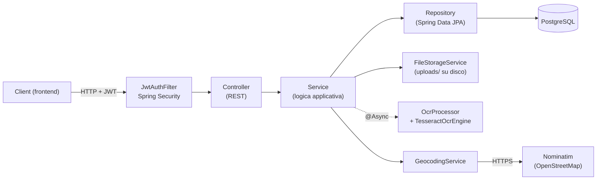

**Scelte progettuali principali:**

- **Controller sottili.** I controller leggono i parametri HTTP e delegano ai service. Validazioni, regole e transazioni stanno nei service e nelle entità, così la logica si testa senza HTTP.
- **DTO come `record`.** Le entità JPA non vengono mai serializzate direttamente. Questo evita di esporre dati sensibili (password, email degli altri utenti) e problemi di lazy loading. La conversione avviene con metodi statici `from(...)`.
- **Regole di dominio vicino ai dati.** `PhotoSource.validatePhotoCount` (1 foto per `CAMERA`, da 1 a 10 per `UPLOAD`) e `Location.of` (coerenza delle coordinate) sono piccole funzioni pure, testate in isolamento.
- **Errori uniformi.** I service lanciano `ApiException` con uno status HTTP. `GlobalExceptionHandler` converte ogni eccezione in una risposta JSON con lo stesso formato.
- **Sessione stateless.** Nessuna sessione lato server: ogni richiesta porta il token JWT nell'header `Authorization`.
- **Segreti fuori dal codice.** Password del database e chiave JWT si leggono da `backend/env.properties`, che non è versionato.

### 2.3 Modello del database ed entità

Lo schema viene generato da Hibernate a partire dalle entità (`spring.jpa.hibernate.ddl-auto=update`).

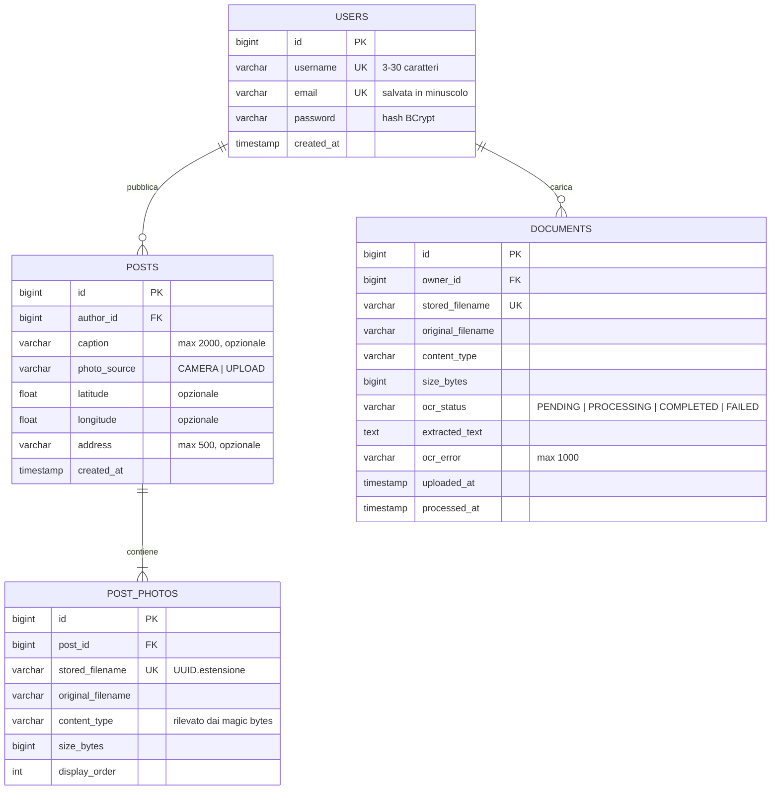

#### Entità

| Entità | Tabella | Descrizione |
|---|---|---|
| `User` | `users` | Utente registrato. La password è salvata solo come hash BCrypt. È il *principal* di Spring Security per la richiesta autenticata. |
| `Post` | `posts` | Post pubblicato da un utente. Contiene didascalia, origine delle foto (`photoSource`), posizione opzionale e l'elenco ordinato delle foto. |
| `Location` | *(incorporata in `posts`)* | `@Embeddable` con `latitude`, `longitude`, `address`. Non ha una tabella propria: le sue colonne stanno nella tabella dei post. **La posizione appartiene al post e non alle singole foto**, come richiesto dalla traccia. |
| `PostPhoto` | `post_photos` | Metadati di una foto. Il file binario sta su disco; il database conserva nome generato, nome originale, formato reale, dimensione e ordine. Relazione `@OneToMany` da `Post` con `cascade = ALL` e `orphanRemoval`: le foto vivono e muoiono con il post. |
| `Document` | `documents` | Documento caricato sul profilo, con stato dell'OCR, testo estratto ed eventuale errore. |

| Enum | Valori | Significato |
|---|---|---|
| `PhotoSource` | `CAMERA`, `UPLOAD` | Origine delle foto del post. Contiene la regola sul numero di foto ammesse. |
| `OcrStatus` | `PENDING`, `PROCESSING`, `COMPLETED`, `FAILED` | Ciclo di vita dell'elaborazione OCR. |

**Relazioni:**
- `User 1 — N Post` (`posts.author_id`)
- `Post 1 — N PostPhoto` (`post_photos.post_id`, almeno una foto per post)
- `User 1 — N Document` (`documents.owner_id`)

Le relazioni `@ManyToOne` sono `LAZY`. Il feed carica l'autore nella stessa query (`@EntityGraph`) e le foto a blocchi (`hibernate.default_batch_fetch_size=50`), per evitare il problema delle query N+1.

### 2.4 Struttura dei controller

Tutti i controller sono `@RestController` sotto il prefisso `/api`. Ricevono l'utente autenticato con `@AuthenticationPrincipal User` e delegano la logica al service corrispondente.

| Controller | Base path | Service | Responsabilità |
|---|---|---|---|
| `AuthController` | `/api/auth` | `AuthService` | Registrazione e login, emissione del token JWT |
| `UserController` | `/api/users` | – | Profilo dell'utente autenticato |
| `PostController` | `/api` | `PostService` | Creazione post multipart, feed, dettaglio, post di un utente, eliminazione |
| `FileController` | `/api/files` | `FileStorageService` | Download pubblico delle foto dei post |
| `DocumentController` | `/api/users/me/documents` | `DocumentService` | Upload documenti, stato e testo OCR, download, eliminazione |
| `GeocodingController` | `/api/geocoding` | `GeocodingService` | Ricerca indirizzo → coordinate e coordinate → indirizzo |

Componenti trasversali:

| Classe | Ruolo |
|---|---|
| `SecurityConfig` | Catena di Spring Security: endpoint pubblici e protetti, CORS, risposte JSON per 401/403, `BCryptPasswordEncoder` |
| `JwtAuthFilter` | Legge `Authorization: Bearer <token>`, verifica il JWT e autentica l'utente |
| `JwtService` | Genera e verifica i token (HMAC-SHA, scadenza configurabile) |
| `GlobalExceptionHandler` | `@RestControllerAdvice`: converte le eccezioni in `ErrorResponse` |
| `FileStorageService` + `FileTypeDetector` | Verifica del formato reale dei file e salvataggio su disco |
| `OcrProcessor` + `TesseractOcrEngine` | Elaborazione OCR asincrona |
| `AsyncConfig` | Pool di thread `ocrExecutor` dedicato all'OCR |
| `AppProperties` | Proprietà `app.*` tipizzate (JWT, storage, OCR, geocoding, CORS) |

### 2.5 Endpoint delle API

Tutti gli endpoint, tranne registrazione, login e download delle foto, richiedono l'header:

```
Authorization: Bearer <token>
```

#### Autenticazione e profilo

| Metodo | Endpoint | Auth | Descrizione | Risposte |
|---|---|---|---|---|
| `POST` | `/api/auth/register` | No | Registra un utente | `201`, `400` dati non validi, `409` username/email già usati |
| `POST` | `/api/auth/login` | No | Login con email e password | `200`, `401` credenziali errate |
| `GET` | `/api/users/me` | Sì | Profilo dell'utente autenticato | `200`, `401` |

```http
POST /api/auth/register
Content-Type: application/json

{ "username": "mario.rossi", "email": "mario@example.com", "password": "password123" }
```

```json
{
  "token": "eyJhbGciOiJIUzM4NCJ9...",
  "user": { "id": 1, "username": "mario.rossi", "email": "mario@example.com", "createdAt": "2026-09-11T10:15:30Z" }
}
```

Vincoli: `username` da 3 a 30 caratteri (lettere, numeri, `.` e `_`), `email` valida, `password` da 8 a 72 caratteri.

#### Post

| Metodo | Endpoint | Auth | Descrizione | Risposte |
|---|---|---|---|---|
| `POST` | `/api/posts` | Sì | Crea un post (`multipart/form-data`) | `201`, `400`, `413`, `415` |
| `GET` | `/api/posts?page=0&size=10` | Sì | Feed paginato, dal più recente | `200` |
| `GET` | `/api/posts/{id}` | Sì | Dettaglio di un post | `200`, `404` |
| `GET` | `/api/users/{userId}/posts?page=0&size=10` | Sì | Post di un utente | `200`, `404` utente inesistente |
| `DELETE` | `/api/posts/{id}` | Sì | Elimina un post e i suoi file (solo l'autore) | `204`, `403`, `404` |
| `GET` | `/api/files/photos/{filename}` | **No** | File di una foto (usabile in ``) | `200`, `404` |

Campi del form di creazione:

| Campo | Tipo | Obbligatorio | Note |
|---|---|---|---|
| `source` | `CAMERA` \| `UPLOAD` | Sì | `CAMERA`: esattamente 1 foto. `UPLOAD`: da 1 a 10 foto |
| `photos` | file (ripetibile) | Sì | JPEG, PNG o WEBP, massimo 10 MB ciascuna |
| `caption` | testo | No | Massimo 2000 caratteri |
| `latitude` | numero | No | Da -90 a 90, obbligatorio insieme a `longitude` |
| `longitude` | numero | No | Da -180 a 180, obbligatorio insieme a `latitude` |
| `address` | testo | No | Massimo 500 caratteri, ammesso solo se ci sono le coordinate |

```bash
curl -X POST http://localhost:8080/api/posts \
  -H "Authorization: Bearer $TOKEN" \
  -F source=UPLOAD \
  -F "photos=@spiaggia.jpg" -F "photos=@tramonto.png" \
  -F "caption=Weekend al mare" \
  -F latitude=40.6333 -F longitude=14.6029 \
  -F "address=Positano, Salerno, Italia"
```

```json
{
  "id": 12,
  "caption": "Weekend al mare",
  "photoSource": "UPLOAD",
  "location": { "latitude": 40.6333, "longitude": 14.6029, "address": "Positano, Salerno, Italia" },
  "photos": [
    { "id": 30, "url": "/api/files/photos/3f2c...e1.jpg", "originalFilename": "spiaggia.jpg", "contentType": "image/jpeg", "size": 482113 },
    { "id": 31, "url": "/api/files/photos/9a7b...44.png", "originalFilename": "tramonto.png", "contentType": "image/png", "size": 1203344 }
  ],
  "author": { "id": 1, "username": "mario.rossi" },
  "createdAt": "2026-09-11T10:20:00Z"
}
```

Le liste paginate hanno il formato `{ "content": [...], "page": 0, "size": 10, "totalElements": 42, "totalPages": 5 }`. `size` è limitato a 50.

#### Documenti del profilo (OCR)

| Metodo | Endpoint | Auth | Descrizione | Risposte |
|---|---|---|---|---|
| `POST` | `/api/users/me/documents` | Sì | Carica un documento (campo multipart `file`) e avvia l'OCR | `202`, `400`, `413`, `415` |
| `GET` | `/api/users/me/documents` | Sì | Documenti dell'utente, dal più recente | `200` |
| `GET` | `/api/users/me/documents/{id}` | Sì | Stato dell'OCR e testo estratto | `200`, `404` |
| `GET` | `/api/users/me/documents/{id}/file` | Sì | Download del file originale | `200`, `404` |
| `DELETE` | `/api/users/me/documents/{id}` | Sì | Elimina il documento e il file | `204`, `404` |

Formati ammessi: **PDF, JPEG, PNG, TIFF**, massimo 20 MB. Un documento di un altro utente risponde `404`, così non si rivela nemmeno la sua esistenza.

```json
{
  "id": 5,
  "originalFilename": "contratto.pdf",
  "contentType": "application/pdf",
  "size": 245310,
  "ocrStatus": "COMPLETED",
  "extractedText": "CONTRATTO DI LOCAZIONE\nTra le parti...",
  "ocrError": null,
  "uploadedAt": "2026-09-11T10:30:00Z",
  "processedAt": "2026-09-11T10:30:07Z"
}
```

#### Geocoding

| Metodo | Endpoint | Auth | Descrizione | Risposte |
|---|---|---|---|---|
| `GET` | `/api/geocoding/search?q=Colosseo Roma` | Sì | Indirizzo → coordinate (massimo 5 risultati) | `200`, `400` query sotto i 3 caratteri, `502` |
| `GET` | `/api/geocoding/reverse?lat=41.8902&lon=12.4922` | Sì | Coordinate → indirizzo (punto scelto sulla mappa) | `200`, `400`, `404`, `502` |

```json
[ { "displayName": "Colosseo, Piazza del Colosseo, Roma, Lazio, Italia", "latitude": 41.8902102, "longitude": 12.4922309 } ]
```

#### Formato degli errori

Tutti gli errori hanno la stessa struttura:

```json
{
  "status": 415,
  "error": "Unsupported Media Type",
  "message": "Il formato del file 'foto.jpg' non e' supportato. Formati ammessi: JPEG, PNG, WEBP",
  "timestamp": "2026-09-11T10:40:00Z"
}
```

Gli errori di validazione aggiungono `details`, per esempio `["email: non e' un indirizzo email valido", ...]`.

| Status | Quando |
|---|---|
| `400` | Parametri mancanti o non validi, regole del post violate, posizione incoerente |
| `401` | Token assente, scaduto o non valido; credenziali errate |
| `403` | Eliminazione di un post di un altro utente |
| `404` | Risorsa inesistente o non appartenente all'utente |
| `409` | Username o email già registrati |
| `413` | File oltre la dimensione massima |
| `415` | Formato del file non ammesso (verificato sul contenuto) |
| `502` | Servizio di geocoding esterno non raggiungibile |

### 2.6 Modalità di implementazione delle funzionalità

#### Autenticazione JWT

1. Alla registrazione `AuthService` controlla che username ed email siano liberi, salva la password con **BCrypt** e restituisce un token.
2. `JwtService` firma il token con **HMAC-SHA** (chiave da `JWT_SECRET`, almeno 32 byte). Il *subject* è l'id utente e la scadenza è di 7 giorni (`app.jwt.expiration`).
3. A ogni richiesta `JwtAuthFilter` verifica firma e scadenza, carica l'utente e lo mette nel `SecurityContext`.
4. Se il token manca o non è valido, gli endpoint protetti rispondono `401` in JSON (entry point personalizzato in `SecurityConfig`).
5. Il login risponde con lo stesso messaggio sia per email inesistente sia per password errata, così non rivela quali email sono registrate.

#### Creazione del post: fotocamera o upload

Il frontend invia sempre una richiesta `multipart/form-data` con il campo `source`:

- **`CAMERA`**: la foto acquisita dalla fotocamera. Il backend accetta **esattamente una** foto.
- **`UPLOAD`**: le foto selezionate dal dispositivo. Il backend accetta **da 1 a 10** foto, salvate nell'ordine di invio (`displayOrder`).

`PostService.create` esegue i passi in quest'ordine:

1. scarta le parti multipart vuote e verifica il numero di foto (`PhotoSource.validatePhotoCount`);
2. valida la posizione (`Location.of`) e la didascalia;
3. **valida il formato e la dimensione di tutte le foto prima di salvarne anche una sola**;
4. salva i file su disco e il post nel database. Se qualcosa fallisce, i file già scritti vengono cancellati.

Una foto non valida quindi non lascia post parziali né file orfani.

#### Verifica e gestione del formato dei file (lato backend)

Il formato **non** si determina dall'estensione né dal `Content-Type` dichiarato dal client, perché entrambi sono falsificabili. `FileTypeDetector` legge i primi 12 byte del file e confronta la **firma binaria (magic bytes)**:

| Formato | Firma | Ammesso per |
|---|---|---|
| JPEG | `FF D8 FF` | foto, documenti |
| PNG | `89 50 4E 47 0D 0A 1A 0A` | foto, documenti |
| WEBP | `RIFF....WEBP` | foto |
| PDF | `%PDF-` | documenti |
| TIFF | `49 49 2A 00` / `4D 4D 00 2A` | documenti |

Conseguenze pratiche:
- un file di testo rinominato `foto.jpg` viene rifiutato con **415**;
- un PNG inviato come `image/jpeg` viene accettato e salvato come `image/png`, cioè con il tipo reale;
- i file oltre il limite (10 MB per le foto, 20 MB per i documenti) vengono rifiutati con **413**. C'è anche un limite globale della richiesta multipart (`spring.servlet.multipart.*`);
- i file vengono salvati con un nome generato (`UUID` + estensione del formato reale). Il nome originale serve solo per la visualizzazione, e `FileStorageService.load` impedisce il *path traversal*.

#### Posizione del post

- `Location` è un `@Embeddable` di `Post`: le colonne `latitude`, `longitude` e `address` stanno nella tabella `posts`. Le foto non hanno campi di posizione.
- Regole (`Location.of`): la posizione è facoltativa; latitudine e longitudine vanno indicate **insieme** e negli intervalli validi; l'indirizzo, se presente, richiede le coordinate.
- **Punto sulla mappa**: il frontend ottiene latitudine e longitudine dal click e può chiamare `/api/geocoding/reverse` per mostrare e salvare anche l'indirizzo.
- **Indirizzo digitato**: il frontend chiama `/api/geocoding/search`, l'utente sceglie un risultato e ne invia coordinate e `displayName` come `address`.

In entrambi i casi il post salva coordinate ed eventuale indirizzo.

#### Documenti e OCR asincrono

L'OCR può richiedere diversi secondi, quindi non blocca la richiesta HTTP:

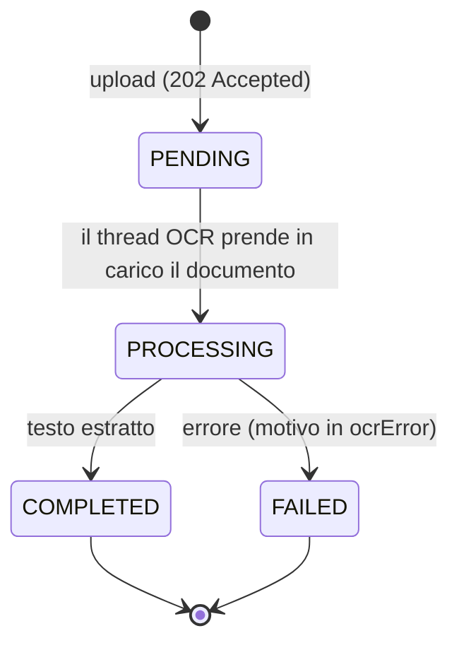

1. `DocumentService.upload` valida il formato, salva il file e il record con stato `PENDING`, poi chiama `OcrProcessor.process(id)`. Il metodo è `@Async("ocrExecutor")`, quindi l'API risponde subito **202 Accepted**.
2. Il pool `ocrExecutor` elabora al massimo 2 documenti in parallelo, perché l'OCR è pesante per la CPU. Gli altri restano in coda.
3. `TesseractOcrEngine` usa **Tesseract** con lingue `ita+eng`:
   - le **immagini** (JPEG, PNG, TIFF) vengono passate direttamente a Tesseract;
   - i **PDF** vengono renderizzati pagina per pagina a 300 DPI con **PDFBox**, e ogni pagina viene letta con l'OCR.
4. L'esito aggiorna il documento: `COMPLETED` con `extractedText` oppure `FAILED` con `ocrError`, più `processedAt`.
5. Il frontend interroga `GET /api/users/me/documents/{id}` (polling) finché lo stato non è `COMPLETED` o `FAILED`.

Il salvataggio del documento non è transazionale di proposito: il record deve essere già nel database quando il thread OCR lo legge.

### 2.7 Librerie utilizzate

| Libreria | Uso nel progetto |
|---|---|
| `spring-boot-starter-webmvc` | Controller REST, upload multipart, serializzazione JSON (Jackson 3) |
| `spring-boot-starter-data-jpa` | Entità, repository, transazioni (Hibernate 7) |
| `spring-boot-starter-validation` | Validazione dei DTO di registrazione e login (`@Valid`, Bean Validation) |
| `spring-boot-starter-security` | Filtri di sicurezza, `BCryptPasswordEncoder`, CORS |
| `spring-boot-starter-restclient` | `RestClient` per le chiamate a Nominatim |
| `io.jsonwebtoken:jjwt` 0.13.0 | Creazione e verifica dei token JWT |
| `net.sourceforge.tess4j:tess4j` 5.19.0 | Binding Java per Tesseract OCR; include **PDFBox 3** per il rendering dei PDF |
| `org.postgresql:postgresql` | Driver JDBC |
| `org.projectlombok:lombok` | Getter/setter e costruttori delle entità e dei service |
| `spring-boot-starter-*-test`, JUnit 5, AssertJ, Mockito, MockMvc | Test |
| `com.h2database:h2` (solo test) | Database in memoria per i test d'integrazione |

### 2.8 Servizi esterni

| Servizio | Tipo | Utilizzo |
|---|---|---|
| **Tesseract OCR** | Motore installato localmente (open source) | Estrazione del testo dai documenti. Non invia dati a terzi. Richiede i file di lingua `ita.traineddata` ed `eng.traineddata` nella cartella `tessdata`. |
| **Nominatim – OpenStreetMap** | API web pubblica e gratuita, senza chiave | Geocoding e reverse geocoding (`https://nominatim.openstreetmap.org`). Il backend fa da proxy: invia uno **User-Agent identificativo** come richiesto dalla [usage policy](https://operations.osmfoundation.org/policies/nominatim/). Il limite è di circa 1 richiesta al secondo, quindi il frontend deve applicare un *debounce* alla ricerca. Dati © OpenStreetMap contributors (ODbL). |
| **PostgreSQL** | Database relazionale locale | Persistenza di utenti, post, foto e documenti. |

### 2.9 Configurazione e avvio

#### Prerequisiti

- **JDK 25**
- **PostgreSQL** con un database vuoto `social_network`
  ```sql
  CREATE DATABASE social_network;
  ```
- **Tesseract OCR** con le lingue italiano e inglese (su Windows il percorso predefinito è `C:\Program Files\Tesseract-OCR\tessdata`)

#### Segreti locali

Copia `backend/env.properties.example` in `backend/env.properties` e compila i valori:

```properties
DB_URL=jdbc:postgresql://localhost:5432/social_network
DB_USERNAME=postgres
DB_PASSWORD=la_tua_password
JWT_SECRET=una_stringa_casuale_di_almeno_32_caratteri
TESSDATA_PATH=C:/Program Files/Tesseract-OCR/tessdata
```

`env.properties` è nel `.gitignore`. Gli stessi valori si possono passare anche come variabili d'ambiente.

Altre proprietà utili in `application.properties`:

| Proprietà | Default | Descrizione |
|---|---|---|
| `app.storage.upload-dir` | `uploads` | Cartella dei file caricati (`uploads/photos`, `uploads/documents`) |
| `app.storage.max-photo-size` | `10MB` | Dimensione massima di una foto |
| `app.storage.max-document-size` | `20MB` | Dimensione massima di un documento |
| `app.ocr.language` | `ita+eng` | Lingue di Tesseract |
| `app.jwt.expiration` | `7d` | Durata del token |
| `app.cors.allowed-origins` | `http://localhost:5173` | Origini ammesse per il frontend (variabile `CORS_ALLOWED_ORIGINS`) |

#### Avvio

Da terminale, nella cartella `backend`:

```bash
# Windows
mvnw.cmd spring-boot:run
# Linux / macOS
./mvnw spring-boot:run
```

Da IntelliJ IDEA: apri `backend/pom.xml` come progetto Maven e avvia `ProgettoSettimana16Application`.

L'API risponde su `http://localhost:8080`.

### 2.10 Test

```bash
cd backend
mvnw.cmd test      # Windows
./mvnw test        # Linux / macOS
```

| Test | Tipo | Cosa verifica |
|---|---|---|
| `FileTypeDetectorTest` | Unitario | Riconoscimento di JPEG, PNG, WEBP, PDF e TIFF dai magic bytes; rifiuto di file falsi o troppo corti |
| `PhotoSourceTest` | Unitario | 1 foto per `CAMERA`, da 1 a 10 per `UPLOAD` |
| `LocationTest` | Unitario | Coordinate insieme, intervalli, indirizzo senza coordinate, limiti di lunghezza |
| `JwtServiceTest` | Unitario | Token valido, firmato con altra chiave, manomesso, scaduto, chiave troppo corta |
| `OcrProcessorTest` | Unitario | Transizioni di stato dell'OCR, messaggio d'errore, documento eliminato nel frattempo |
| `GeocodingServiceTest` | Unitario (server HTTP simulato) | Mappatura delle risposte di Nominatim, User-Agent, 400, 404, 502 |
| `TesseractOcrEngineTest` | Integrazione con Tesseract reale | Testo estratto da un'immagine e da un PDF di più pagine (saltato se Tesseract non è installato) |
| `AuthApiTest` | Integrazione (MockMvc + H2) | Registrazione, duplicati, validazione, login, 401 |
| `PostApiTest` | Integrazione (MockMvc + H2) | Post `CAMERA`/`UPLOAD`, posizione, formati falsi (415), dimensione (413), atomicità, feed, permessi di eliminazione |
| `DocumentApiTest` | Integrazione (MockMvc + H2) | Upload con avvio OCR, formati, isolamento tra utenti, download, eliminazione |

I test d'integrazione usano il profilo `test` con un database H2 in memoria: non serve PostgreSQL per eseguirli.

#### Collection Postman

In `backend/postman/` ci sono una collection e un environment pronti da importare, con i file di esempio per i form multipart: `files/foto-1.jpg`, `files/foto-2.jpg`, `files/foto-falsa.jpg` (un file di testo con estensione `.jpg`) e `files/documento-ocr.pdf`.

1. In Postman scegli **Import** e seleziona `Scatto.postman_collection.json` e `Scatto-locale.postman_environment.json`.
2. In alto a destra attiva l'environment **Scatto - locale** (`baseUrl` = `http://localhost:8080`).
3. In **Settings → General → Working directory** imposta la cartella `backend/postman`, così Postman trova i file dei form. In alternativa riseleziona il file nella scheda *Body* della richiesta.
4. Esegui per prima **1. Autenticazione → Registrazione (201)**: lo script crea un utente nuovo e salva `token`, `email`, `password` e `userId` nell'environment. Le altre richieste ereditano dalla collection l'autorizzazione *Bearer Token* con `{{token}}`.
5. Prosegui in ordine, oppure esegui tutto con **Run collection** impostando un ritardo di 2500 ms tra le richieste, così l'OCR ha il tempo di completare.

| Cartella | Richieste |
|---|---|
| 1. Autenticazione | Registrazione `201`, login `200`, utente corrente `200`, dati non validi `400`, registrazione duplicata `409`, password errata `401` |
| 2. Post | Post `UPLOAD` con 2 foto e posizione `201`, post `CAMERA` con 1 foto `201`, `CAMERA` con 2 foto `400`, foto con formato falso `415`, indirizzo senza coordinate `400`, feed, dettaglio, post di un utente, foto pubblica senza token, eliminazione dei due post `204` |
| 3. Documenti OCR | Upload `202`, lista, stato OCR e testo estratto, download del file originale, documento con formato falso `415`, eliminazione `204` |
| 4. Geocoding | Indirizzo → coordinate, coordinate → indirizzo, ricerca troppo corta `400` |
| 5. Errori di autenticazione | Richiesta protetta senza token `401` |

Ogni richiesta verifica la risposta con `pm.test`, e la collection cancella i post e il documento che crea. È stata eseguita per intero con Newman contro il backend reale: 27 richieste e 40 verifiche, tutte superate. Dalla cartella `backend/postman`:

```bash
npx newman run Scatto.postman_collection.json -e Scatto-locale.postman_environment.json --working-dir . --delay-request 2500
```

### 2.11 Limiti noti e possibili evoluzioni

- **Storage locale**: i file sono sul disco del server. Con più istanze servirebbe uno storage condiviso (es. S3), sostituendo l'implementazione di `FileStorageService`.
- **Coda OCR in memoria**: se l'applicazione si ferma durante l'elaborazione, i documenti restano `PENDING`/`PROCESSING`. Una coda persistente o una ripresa all'avvio risolverebbe il problema.
- **Schema del database**: generato da Hibernate (`ddl-auto=update`). In produzione servirebbero migrazioni versionate (Flyway o Liquibase).
- **Nominatim pubblico**: adatto a uso didattico e a basso traffico; per volumi maggiori serve un'istanza propria o un provider commerciale.

---

## 3. Frontend

Il frontend si chiama **Scatto**: è una single page application in italiano che usa tutte le API del backend. Permette di registrarsi, sfogliare il feed, pubblicare post con foto e posizione e gestire i documenti del profilo con il testo estratto dall'OCR.

### 3.1 Stack tecnologico

| Componente | Versione | Ruolo |
|---|---|---|
| React | 19.3 | Interfaccia a componenti |
| Vite | 8.3 | Dev server (porta 5173, già ammessa dal CORS del backend) e build |
| React Router | 8.3 | Rotte e pagine protette |
| Leaflet | 1.9.4 | Mappa interattiva con tile OpenStreetMap |
| Phosphor Icons | 2.1 | Icone SVG con tratto uniforme |
| Poppins e Inter (Fontsource) | 5.3 | Caratteri del brand (Poppins per titoli e logo, Inter per i testi), inclusi nel bundle: nessuna richiesta a Google Fonts |
| CSS nativo | – | Stili con custom properties, senza framework CSS |

JavaScript, senza TypeScript. I test usano il test runner integrato di Node.js (`node --test`), quindi non servono librerie di test.

### 3.2 Scelte progettuali

- **Poche dipendenze, piattaforma prima delle librerie.** Solo sette pacchetti a runtime, due dei quali sono i font del brand. Dove il browser offre già la funzione, si usa quella:
  - `<dialog>` nativo per le finestre di conferma (focus, tasto Esc e sovrapposizione gestiti dal browser);
  - `scroll-snap` CSS per il carosello delle foto (swipe, inerzia e interruzione del gesto sono nativi);
  - `FormData` per le richieste multipart, `getUserMedia` e `<canvas>` per la fotocamera;
  - `fetch` con un piccolo wrapper al posto di librerie HTTP; stato locale con `useState` e un solo Context per l'autenticazione.
- **Logica in moduli puri.** Le regole sui file (`lib/fileValidation.js`) non dipendono da React: sono testate da sole con Node e riusate da foto e documenti.
- **Stesse regole del backend.** Formati, dimensioni, numero di foto, lunghezza di didascalia e indirizzo, vincoli di username e password sono replicati lato client: l'utente vede subito l'errore, e il backend resta comunque l'ultima difesa.
- **Brand identity "Scatto" applicata a tutta l'interfaccia**, a partire dalla brand board:
  - palette del brand: nero `#0F0F0F` come sfondo, grigio chiaro `#F5F5F7` per i testi, bianco, viola `#7C3AED` riservato ad azioni e stato attivo (il viola chiaro `#A78BFA` per i testi, per il contrasto); tema scuro in tutto il sito;
  - tipografia: **Poppins** per titoli, nomi utente e logo, **Inter** per testi, etichette e dati, con numeri tabulari per date e dimensioni;
  - logo ridisegnato in SVG (`components/Logo.jsx`): tre angoli del mirino, obiettivo pieno e punto viola al posto del quarto angolo; lo stesso segno su fondo viola è la favicon;
  - gli elementi grafici del brand hanno sempre una funzione: gli **angoli del mirino** sostituiscono i bordi tratteggiati delle aree di caricamento e inquadrano il post al centro dello schermo; il **punto viola** segna la voce di navigazione attiva; le **righe diagonali** indicano un lavoro in corso (OCR in elaborazione, file trascinato sull'area); blob, righe e mirino compongono lo splash viola della pagina di accesso.
- **Il feed come parete di mostra.** Ogni post è un'opera appesa con la sua didascalia sotto: autore, testo, **Tecnica** (Fotocamera o Upload, con il numero di foto) e **Luogo**, sempre nello stesso punto. Così i requisiti della traccia si leggono a colpo d'occhio. La gerarchia la danno i piani (parete, pannello, sovrapposizione), senza card annidate.
- **Riga degli autori recenti** in stile storie, come nel mockup del brand, ma con dati veri: gli autori dei post caricati, con l'anello viola, portano al loro profilo. Il primo cerchio apre un nuovo post. Non vengono simulate funzioni che il backend non ha (storie, notifiche, ricerca utenti).
- **Navigazione adattiva**: su desktop una colonna laterale con logo, voci e pulsante "Nuovo post"; su mobile una barra in alto e una barra in basso con il **+ viola** centrale sollevato, a portata di pollice.
- **Movimento sobrio**: transizioni di stato di 160-320 ms con uscita esponenziale e un solo momento firmato, la "messa a fuoco" degli angoli del mirino sul post. Rispetto di `prefers-reduced-motion` e `prefers-reduced-transparency`.
- **Stati e dettagli completi**: skeleton di caricamento, stati vuoti con l'azione da compiere, errori vicini al punto in cui nascono; selezione del testo, cursore, autocompletamento e barre di scorrimento a tema.
- **Accessibilità di base.** Etichette visibili sopra i campi, errori collegati con `aria-describedby`, messaggi `role="alert"`, pulsanti icona con `aria-label`, focus visibile, target di tocco di almeno 44 px.

### 3.3 Struttura delle cartelle

```
frontend/
├── index.html
├── package.json
├── PRODUCT.md                 ← contesto di prodotto e impegni del brand (guida le scelte di design)
├── DESIGN.md                  ← design system del brand ricavato dal codice: token, tipografia, griglia, regole
├── public/
│   └── favicon.svg            ← segno del logo su fondo viola
├── docs/
│   └── screenshots/           ← schermate usate nel README (sezione 3.11)
├── vite.config.js             ← porta 5173 fissa (strictPort) per il CORS
├── .env.example               ← VITE_API_URL di esempio
└── src/
    ├── main.jsx               ← monta React, router e AuthProvider
    ├── App.jsx                ← definizione delle rotte
    ├── index.css              ← token del brand (colori, font, raggi, movimento), mirino, controlli, guscio, mappa
    ├── auth/
    │   └── AuthContext.jsx    ← utente corrente, login, registrazione, logout, gestione del 401
    ├── lib/
    │   ├── api.js             ← fetch verso il backend, token, errori, download protetti
    │   ├── fileValidation.js  ← verifica dei formati (unico punto con le regole sui file)
    │   ├── fileValidation.test.js
    │   ├── format.js          ← dimensioni in KB/MB, date e tempo relativo in italiano
    │   └── usePagedPosts.js   ← hook per le liste di post paginate
    ├── components/
    │   ├── Shell.jsx          ← colonna laterale (desktop), barre in alto e in basso (mobile), pagine protette
    │   ├── Logo.jsx           ← logo SVG del brand: segno del mirino e scritta
    │   ├── ui.jsx             ← Avatar, Viewfinder, EmptyState, Spinner, ErrorNote, Segmented, Modal, ConfirmDialog
    │   ├── PostCard.jsx       ← post come opera con didascalia: carosello, tecnica, luogo, mappa, eliminazione
    │   ├── posts.css
    │   ├── MapView.jsx        ← wrapper di Leaflet (caricato solo quando serve)
    │   ├── CameraCapture.jsx  ← scatto con la fotocamera
    │   ├── PhotoPicker.jsx    ← selezione multipla con anteprime
    │   ├── LocationPicker.jsx ← posizione da mappa o da indirizzo
    │   └── Documents.jsx      ← upload, lista, polling OCR, testo estratto
    └── pages/
        ├── AuthPage.jsx       ← login e registrazione (auth.css)
        ├── FeedPage.jsx       ← feed paginato con la riga degli autori recenti
        ├── CreatePostPage.jsx ← creazione del post (create.css)
        └── ProfilePage.jsx    ← profilo, griglia dei post, documenti (profile.css)
```

### 3.4 Pagine e componenti

| Rotta | Pagina | Accesso | Contenuto |
|---|---|---|---|
| `/login` | `AuthPage` | Pubblica | Login con email e password |
| `/register` | `AuthPage` | Pubblica | Registrazione con username, email e password |
| `/` | `FeedPage` | Protetta | Riga degli autori recenti, post dal più recente, pulsante "Carica altri" |
| `/new` | `CreatePostPage` | Protetta | Fotocamera o upload, didascalia, posizione, pubblicazione |
| `/profile` | `ProfilePage` | Protetta | Dati dell'utente, griglia dei suoi post, sezione Documenti (`?sezione=documenti`) |
| `/users/:id` | `ProfilePage` | Protetta | Post di un altro utente (si apre dal nome dell'autore nel feed) |

`Shell` avvolge tutte le pagine protette: se non c'è un utente autenticato reindirizza a `/login` e, dopo l'accesso, riporta alla pagina richiesta.

`PostCard` mostra la foto (carosello con scroll-snap e indicatori se sono più di una, formato 4:5) e sotto la didascalia: autore con data relativa ("5 minuti fa"), testo, **Tecnica** con l'origine delle foto (Fotocamera o Upload e numero di foto) e **Luogo**. L'indirizzo è un pulsante che apre una piccola mappa con il marker. Il cestino compare solo sui post dell'utente (`author.id === user.id`) e chiede conferma. Nel feed un `IntersectionObserver` segnala il post che attraversa il centro dello schermo: gli angoli del mirino lo inquadrano (lo stesso effetto compare al passaggio del mouse e con il focus da tastiera). Se il file di una foto non si carica, al posto dell'icona rotta del browser compare un riquadro "Foto non disponibile".

### 3.5 Modalità di implementazione delle funzionalità

#### Autenticazione e gestione del token

1. Login e registrazione chiamano `/api/auth/login` e `/api/auth/register`. La risposta `{ token, user }` viene salvata in `localStorage` (`scatto.token`, `scatto.user`) e l'utente entra nel `AuthContext`.
2. `lib/api.js` aggiunge `Authorization: Bearer <token>` a ogni richiesta quando il token esiste.
3. All'avvio, se c'è un token, l'app chiama `/api/users/me` per verificarlo e aggiornare i dati dell'utente.
4. Se una chiamata **con token** riceve `401` (token scaduto o non valido), `api.js` cancella la sessione e l'`AuthContext` porta al login con il messaggio "La sessione è scaduta". Un `401` sul login senza token resta invece un normale errore di credenziali.
5. Il logout cancella token e utente e torna al login.
6. I campi sono validati anche lato client (username di 3-30 caratteri tra lettere, numeri, `.` e `_`; email valida; password di 8-72 caratteri). Gli errori del backend, per esempio `409` username o email già usati e `401` credenziali errate, sono mostrati sotto il modulo con `message` e `details`.

#### Creazione del post: fotocamera o upload

Un controllo segmentato sceglie la modalità. Le foto delle due modalità sono tenute separate: cambiando modalità non si perde la selezione dell'altra.

- **Scatta foto (`source=CAMERA`)**
  1. `navigator.mediaDevices.getUserMedia` apre la fotocamera (posteriore se disponibile) in un `<video>`. Il permesso viene chiesto solo quando l'utente sceglie questa modalità.
  2. Il pulsante otturatore disegna il fotogramma su un `<canvas>` e lo converte con `canvas.toBlob(..., 'image/jpeg')` in un `File` chiamato `foto-camera.jpg`.
  3. Compaiono l'anteprima e il pulsante "Rifai la foto", che riapre la fotocamera. Si può tenere **una sola** foto.
  4. Permesso negato, fotocamera assente o già in uso mostrano un messaggio specifico, un pulsante "Riprova" e il ripiego `<input type="file" accept="image/*" capture="environment">`, che su mobile apre la fotocamera di sistema.
  5. Lo stream viene fermato quando si cambia modalità, si scatta o si lascia la pagina.
- **Carica foto (`source=UPLOAD`)**
  1. Selezione multipla con click o trascinamento, da 1 a 10 immagini.
  2. Anteprime numerate nell'ordine di invio, ognuna con il pulsante per rimuoverla; la prima è segnata come **Copertina**, perché è quella mostrata nella griglia del profilo; contatore "3 di 10 foto" con la dimensione totale.
  3. I file oltre il decimo non vengono aggiunti e l'utente viene avvisato.

Alla pubblicazione il modulo controlla numero di foto e didascalia, riverifica i file e costruisce il `FormData`: `source`, un campo `photos` per ogni foto, `caption` se presente, `latitude`, `longitude` e `address` se c'è una posizione. Il `Content-Type` multipart lo imposta il browser. Durante l'invio il pulsante mostra lo stato di caricamento; in caso di successo si torna al feed con la conferma "Post pubblicato", in caso di errore resta tutto compilato e il messaggio del backend è visibile.

#### Verifica dei formati lato frontend

Tutte le regole sono in `src/lib/fileValidation.js` e sono le stesse del backend:

| | Formati | Dimensione massima | Quantità |
|---|---|---|---|
| Foto dei post (`PHOTO_RULES`) | JPEG, PNG, WEBP | 10 MB ciascuna | `CAMERA` 1, `UPLOAD` da 1 a 10 (`PHOTO_LIMITS`) |
| Documenti (`DOCUMENT_RULES`) | PDF, JPEG, PNG, TIFF | 20 MB | 1 per upload |

Per ogni file `checkFile` esegue i controlli in quest'ordine e si ferma al primo che fallisce:

1. **estensione** del nome tra quelle ammesse;
2. **`file.type`** dichiarato dal browser tra quelli ammessi (se presente);
3. file **non vuoto** e **dimensione** entro il limite;
4. **magic bytes**: `file.slice(0, 12).arrayBuffer()` legge i primi byte e li confronta con le firme:

| Formato | Firma |
|---|---|
| JPEG | `FF D8 FF` |
| PNG | `89 50 4E 47 0D 0A 1A 0A` |
| WEBP | `RIFF` ai byte 0-3 e `WEBP` ai byte 8-11 |
| PDF | `%PDF-` |
| TIFF | `49 49 2A 00` oppure `4D 4D 00 2A` |

Come nel backend, decide il contenuto: un PNG rinominato `.jpg` viene accettato, un file di testo rinominato `foto.jpg` viene rifiutato. `validateFiles` separa i file validi dai rifiutati e restituisce un messaggio per ciascun rifiuto, per esempio `foto.heic: formato non supportato (ammessi JPEG, PNG, WEBP)` oppure `grande.jpg: troppo grande (12,4 MB, massimo 10 MB)`. I file validi vengono comunque aggiunti.

L'attributo `accept` degli input (`acceptFor(rules)`) filtra solo la finestra di selezione, perché si può aggirare, per esempio trascinando un file. Gli errori `413` e `415` del backend restano gestiti e mostrati con il loro `message`.

#### Mappa e ricerca dell'indirizzo

`LocationPicker` offre due modi per scegliere la posizione, che appartiene al post:

- **Punto sulla mappa.** Il click su Leaflet posiziona subito il marker e salva le coordinate (6 decimali). Dopo 600 ms senza altri click parte `GET /api/geocoding/reverse`: l'indirizzo trovato viene mostrato e inviato come `address`. Se il punto non ha un indirizzo (`404`, per esempio in mare) restano solo le coordinate.
- **Indirizzo.** Il campo di ricerca chiama `GET /api/geocoding/search` con **debounce di 600 ms** e solo da **3 caratteri** in su, per rispettare il limite di Nominatim di circa una richiesta al secondo. Le ricerche superate vengono annullate con `AbortController`. Scegliendo un risultato (click o Invio) il marker si sposta, e `latitude`, `longitude` e `address` (`displayName`) vengono compilati.

Il riquadro della posizione scelta mostra indirizzo e coordinate, con il pulsante **Rimuovi**. Un `502` del geocoding viene mostrato come errore senza bloccare il resto del modulo.

`MapView` è un wrapper di Leaflet senza librerie React intermedie. Il marker è disegnato in CSS, così non servono le immagini di default di Leaflet; un `ResizeObserver` ricalcola la mappa quando nasce in un contenitore non ancora visibile. Le tile vengono portate sul tema scuro con un filtro CSS (inversione e leggera virata verso il viola del brand), senza cambiare fornitore; il marker è viola con bordo bianco. Leaflet è caricato con `React.lazy` solo quando una mappa compare davvero: il bundle iniziale scende da circa 500 kB a 350 kB.

#### Upload dei documenti e polling dell'OCR

1. La sezione **Documenti** del profilo accetta un file alla volta (click o trascinamento), verificato con `DOCUMENT_RULES` prima dell'invio.
2. `POST /api/users/me/documents` con il campo `file` risponde `202`: il documento compare in cima alla lista con stato "In attesa" e il dettaglio si apre.
3. **Polling:** finché almeno un documento è `PENDING` o `PROCESSING`, ogni 2 secondi l'app richiede `GET /api/users/me/documents/{id}` per quei documenti e aggiorna la lista. Il timer si ferma da solo quando tutti sono `COMPLETED` o `FAILED`, e viene annullato se si lascia la pagina.
4. Ogni riga ha un badge di stato: **In attesa** (righe diagonali del brand ferme), **In elaborazione** (righe che scorrono e icona animata), **Completato** (spunta), **Errore** (in rosso, l'unico colore semantico oltre al viola). Lo stato non è mai indicato dal solo colore (c'è sempre nome e icona) e la colonna del badge ha larghezza fissa, così il cambio di stato non sposta la riga.
5. Aprendo una riga si vede:
   - il **testo estratto** (`extractedText`) con il pulsante **Copia**, che usa la Clipboard API e conferma con "Copiato";
   - oppure `ocrError` se l'elaborazione è fallita;
   - oppure un'animazione di attesa mentre l'OCR lavora.
6. **Download:** l'endpoint richiede il token, quindi `downloadFile` usa `fetch` con l'header `Authorization`, converte la risposta in `blob`, crea un URL con `URL.createObjectURL` e avvia il download con il nome `originalFilename`.
7. **Eliminazione** con finestra di conferma e `DELETE /api/users/me/documents/{id}`.

#### Gestione degli errori

Tutte le chiamate passano da `api()`, che trasforma le risposte non riuscite in `ApiError` con `status`, `message` e `details` presi dal formato d'errore comune del backend. Il componente `ErrorNote` mostra il messaggio e l'elenco dei dettagli nel punto della pagina in cui è nato l'errore. Se il backend non è raggiungibile compare "Impossibile raggiungere il server".

### 3.6 Librerie utilizzate

| Libreria | Uso nel progetto | Perché |
|---|---|---|
| `react`, `react-dom` | Componenti e rendering | Standard del corso; lo stato locale basta, nessuna libreria di stato |
| `react-router` | Rotte, redirect, parametri (`/users/:id`), query string della sezione del profilo | Gestione degli URL e del tasto indietro senza reinventarla |
| `leaflet` | Mappa, click per scegliere il punto, marker | Gratuita, senza chiave, coerente con OpenStreetMap e Nominatim del backend |
| `@phosphor-icons/react` | Icone | Set completo con pesi coerenti (regular e fill per la tab attiva), importabili una per una |
| `@fontsource/poppins`, `@fontsource-variable/inter` | Poppins (500, 600, 700) per titoli, nomi e logo; Inter variabile per testi e dati | Sono i caratteri della brand identity; serviti dal bundle, quindi niente richieste a servizi esterni per i font |
| `vite`, `@vitejs/plugin-react` (sviluppo) | Dev server e build | Avvio immediato, variabili d'ambiente `VITE_*`, code splitting |

### 3.7 Servizi esterni

| Servizio | Tipo | Utilizzo |
|---|---|---|
| **Backend Spring Boot** | API REST del progetto | Tutti i dati, gli upload e il geocoding. URL in `VITE_API_URL`. |
| **Tile di OpenStreetMap** | Immagini della mappa, gratuite e senza chiave | `https://tile.openstreetmap.org/{z}/{x}/{y}.png`, caricate direttamente dal browser da Leaflet. Attribuzione "© OpenStreetMap contributors" sempre visibile sulla mappa, come richiesto dalla [tile usage policy](https://operations.osmfoundation.org/policies/tiles/). |
| **Nominatim (OpenStreetMap)** | Geocoding, **tramite il backend** | Il frontend non chiama mai Nominatim direttamente: usa `/api/geocoding/search` e `/api/geocoding/reverse`, e applica debounce e soglia minima per rispettarne i limiti. |

### 3.8 Configurazione e avvio

#### Prerequisiti

- **Node.js** con npm (testato con Node 24 e npm 11)
- Il **backend avviato** su `http://localhost:8080` (vedi [2.9](#29-configurazione-e-avvio))

#### Variabili d'ambiente

Copia `frontend/.env.example` in `frontend/.env.local` e, se serve, cambia l'URL del backend:

```properties
VITE_API_URL=http://localhost:8080
```

`.env.local` è nel `.gitignore`. Se la variabile manca, l'app usa `http://localhost:8080`.

#### Avvio

```bash
cd frontend
npm install
npm run dev
```

L'app risponde su **http://localhost:5173**. La porta è fissa (`strictPort`) perché il backend accetta CORS solo da quell'origine: se fosse occupata Vite si ferma invece di cambiare porta. Per usare un'altra porta avvia il backend con `CORS_ALLOWED_ORIGINS=http://localhost:<porta>`.

Altri comandi:

| Comando | Descrizione |
|---|---|
| `npm run build` | Build di produzione in `frontend/dist` |
| `npm run preview` | Serve la build di produzione in locale |
| `npm test` | Test della verifica dei file |

La fotocamera con `getUserMedia` funziona su `localhost` o su HTTPS; da un altro indirizzo in HTTP il browser la blocca e l'app propone il ripiego con `<input capture>`.

### 3.9 Test

```bash
cd frontend
npm test
```

| Test | Cosa verifica |
|---|---|
| `fileValidation.test.js` | Riconoscimento di JPEG, PNG, WEBP, PDF e TIFF dai magic bytes; foto valide anche con estensione diversa dal contenuto; rifiuto di estensione non ammessa (`.heic`), contenuto falso, file vuoto e file oltre 10 MB con il messaggio esatto; regole dei documenti; separazione tra file validi e rifiutati |

I test girano con il test runner di Node.js e l'oggetto `File` nativo, senza browser. L'intero flusso è stato provato nel browser contro il backend reale: registrazione, upload con file rifiutati, ricerca dell'indirizzo, scatto dalla fotocamera, punto sulla mappa, eliminazione, OCR di un documento, token scaduto, schermi mobile e tema scuro.

### 3.10 Limiti noti e possibili evoluzioni

- **Token in `localStorage`**: semplice e adatto a un'API stateless, ma leggibile da script in caso di XSS. In produzione si potrebbe usare un cookie `HttpOnly` emesso dal backend.
- **Paginazione a offset**: se si elimina un post e poi si carica la pagina successiva, un post può essere saltato. Una paginazione a cursore lato API lo eviterebbe.
- **Polling dell'OCR**: semplice e robusto; con molti utenti converrebbe una notifica push (Server-Sent Events o WebSocket).
- **Foto ritagliate**: nel feed le immagini sono ritagliate in 4:5 e nella griglia del profilo in 1:1, per un layout ordinato e senza salti durante il caricamento; le proporzioni originali non vengono mostrate.
- **Ordine delle foto**: è visibile e segue l'ordine di selezione; per cambiarlo si rimuove e si riaggiunge una foto (nessun trascinamento per riordinare).

### 3.11 Screenshot

Schermate dell'applicazione in esecuzione contro il backend reale, con utenti e post dimostrativi (foto da Unsplash).

#### Accesso e registrazione

Splash del brand con il modulo di accesso; su mobile il modulo sale sopra il pannello viola.

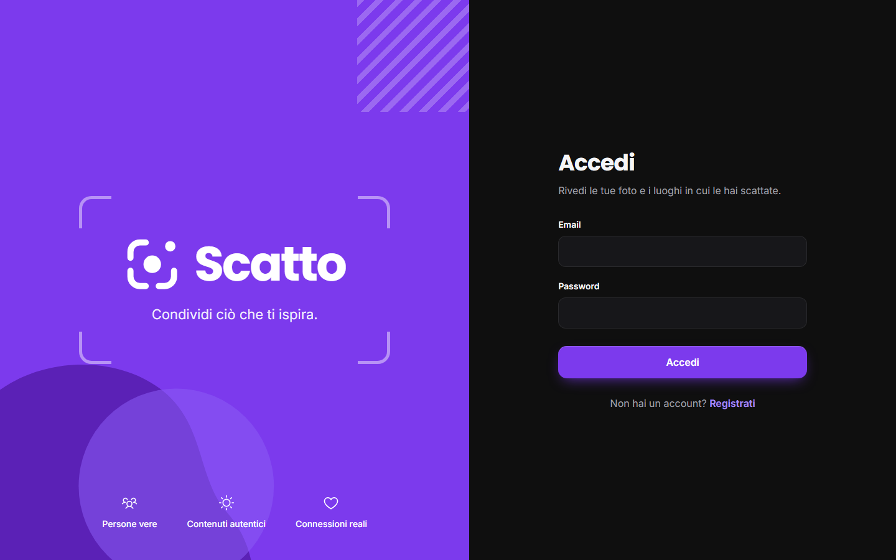 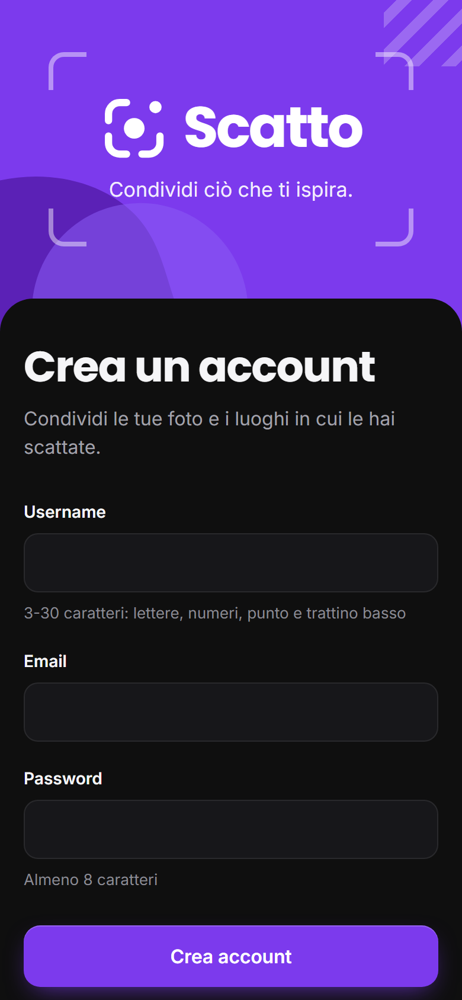

#### Feed

Riga degli autori recenti e post con la didascalia: autore, testo, **Tecnica** (Fotocamera o Upload) e **Luogo**. Su mobile la barra in basso ha il + centrale.

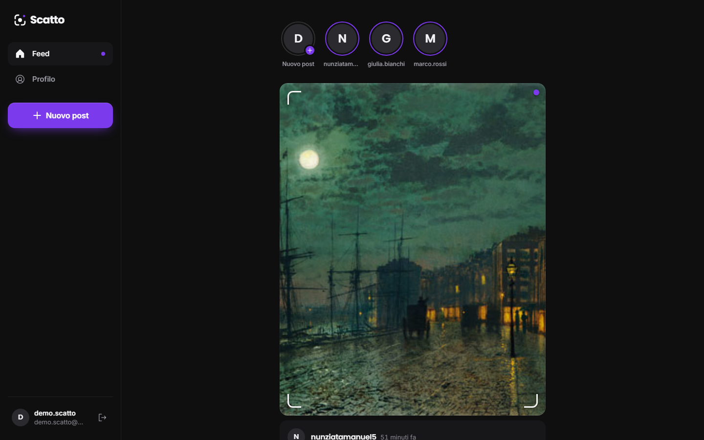 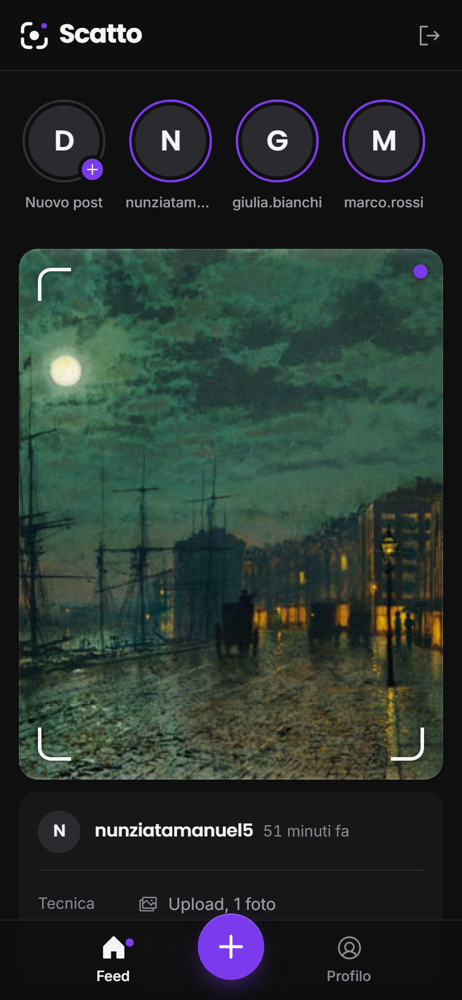

#### Posizione del post nel feed

L'indirizzo del post apre la mappa OpenStreetMap con il marker.

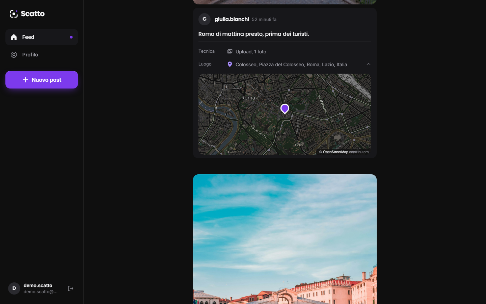

#### Nuovo post: upload e verifica dei formati lato frontend

Tre foto valide con anteprime numerate e copertina; i due file non ammessi sono rifiutati prima dell'invio, uno per l'estensione (`documento.heic`) e uno per il contenuto letto dai magic bytes (`foto-falsa.jpg`).

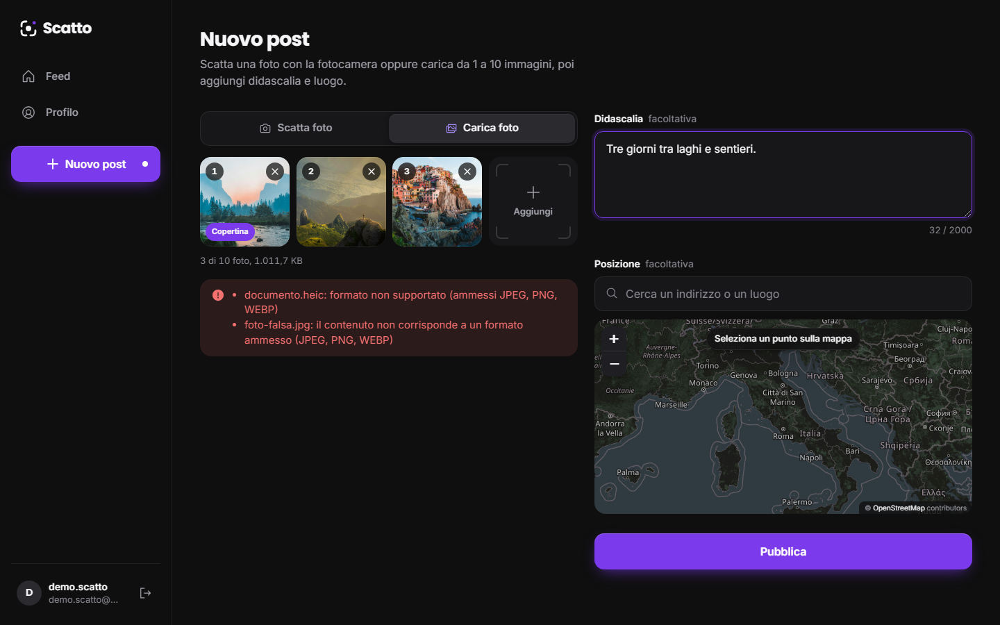

#### Nuovo post: foto dalla fotocamera

Anteprima dal vivo con `getUserMedia`, mirino e otturatore: si scatta una sola foto.

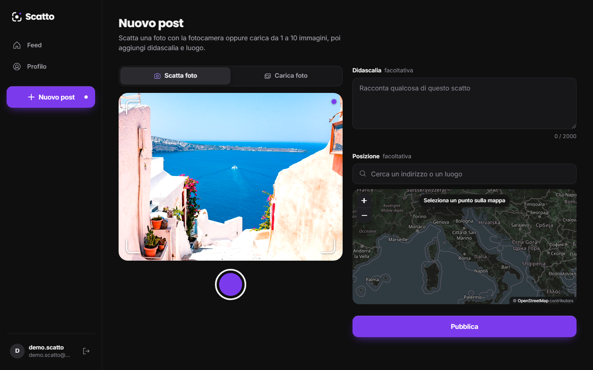

#### Posizione: ricerca dell'indirizzo e punto sulla mappa

Ricerca con debounce tramite il geocoding del backend; scegliendo un risultato il marker si sposta e coordinate e indirizzo vengono compilati.

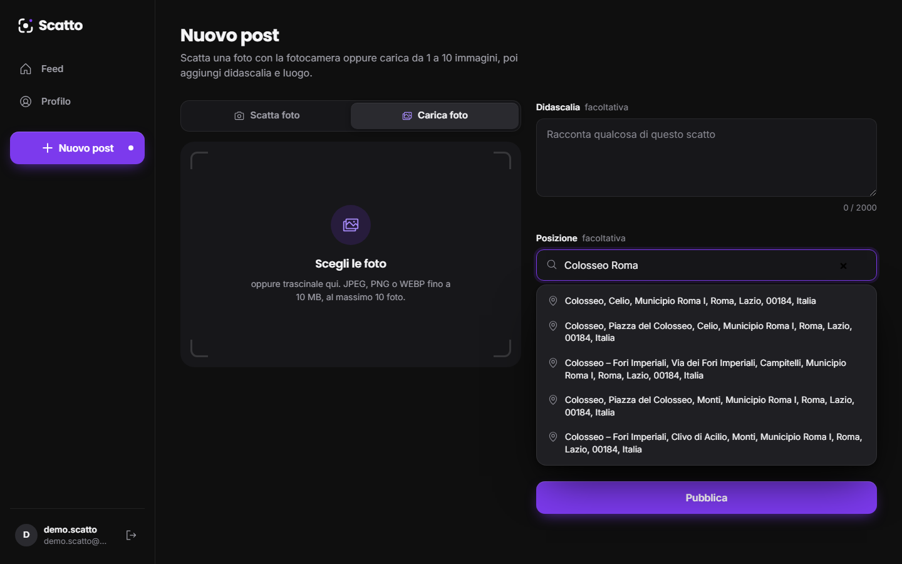

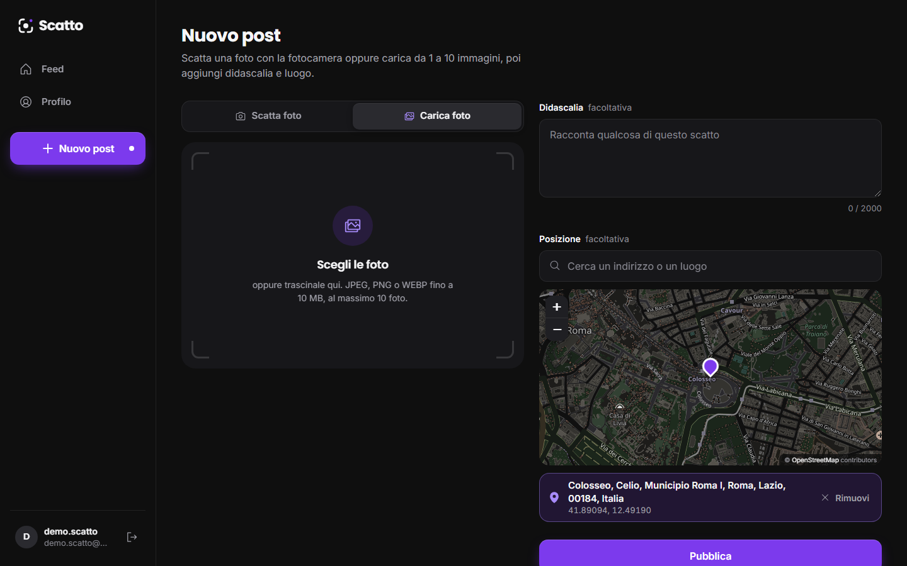

#### Profilo e documenti con OCR

Griglia dei post dell'utente e sezione Documenti con il badge di stato e il testo estratto dall'OCR, con i pulsanti Copia, Scarica ed Elimina.

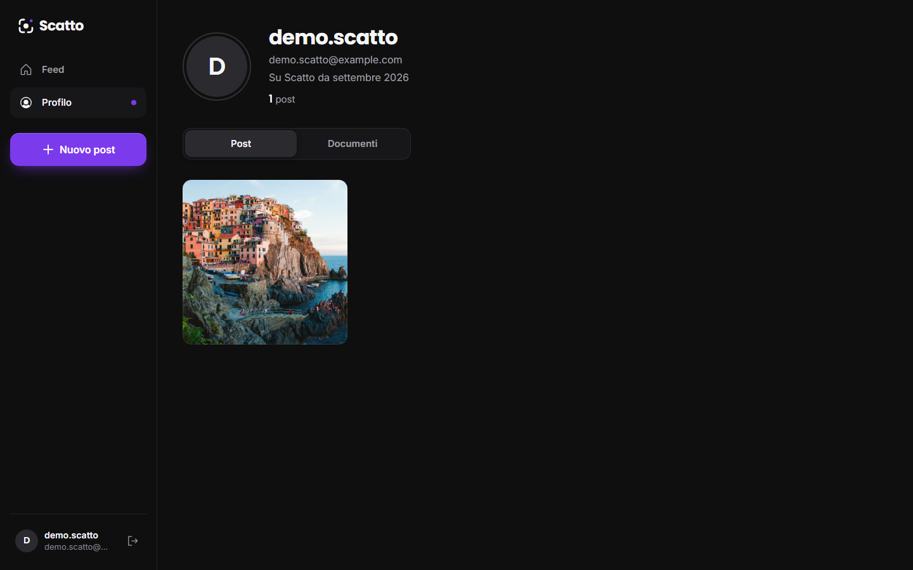

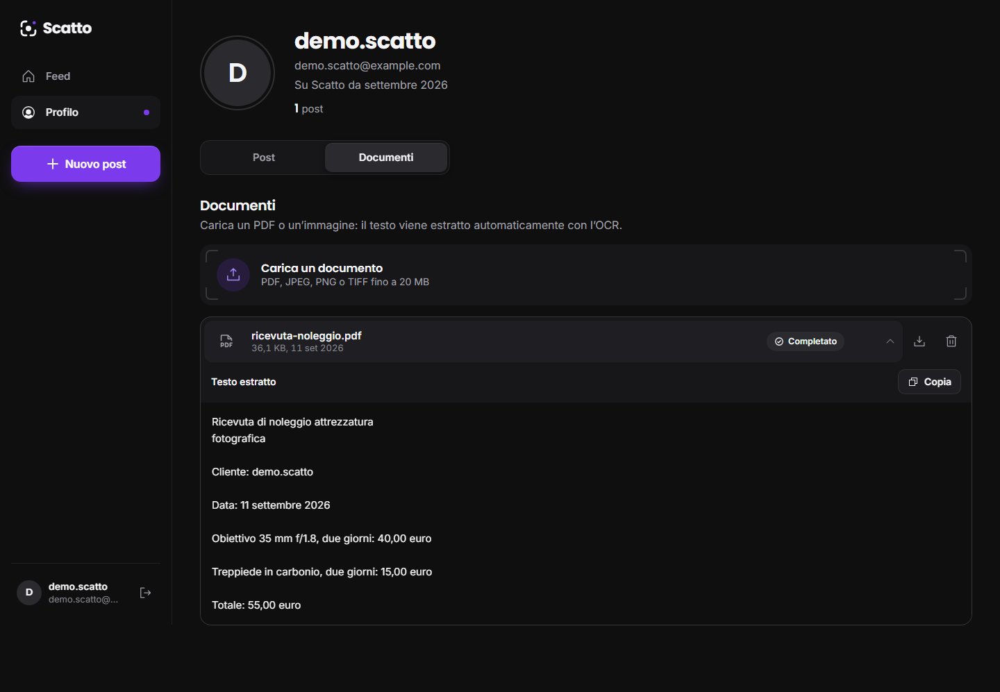
